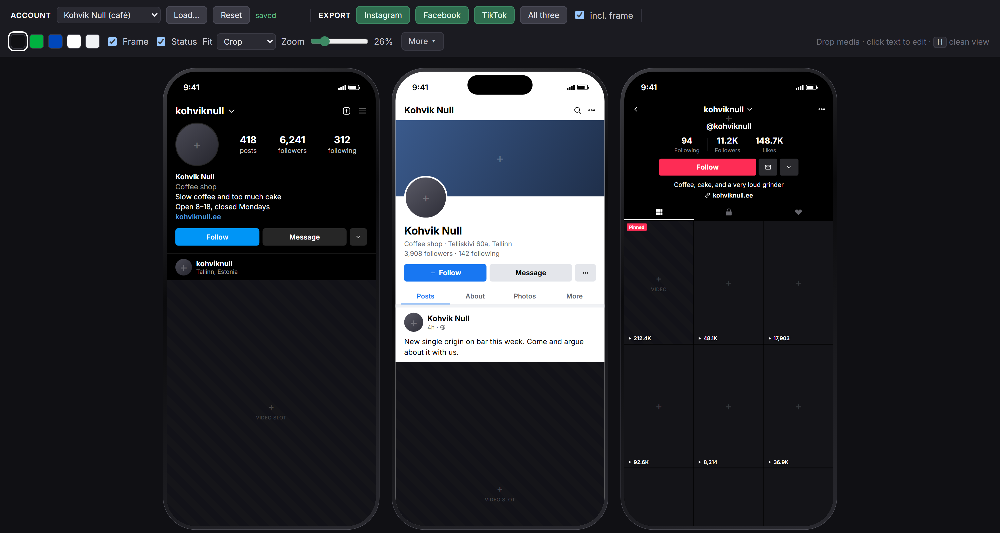

# Onscreen Socials

**Social profile mockups for video.**

Three phone screens side by side — Instagram, Facebook Page, TikTok — each showing a
profile header and one video slot. Built for compositing into video, where the profile
name and the follower count have to read clearly for three seconds and the post
underneath is set dressing.

Drop in your own footage, retype the numbers, export a PNG at true iPhone resolution with
transparent corners. Runs entirely in the browser: no account, no upload, nothing leaves
the machine.



---

## Run it

It is a static site, so any web server will do:

```bash
npx serve .          # or: python -m http.server
```

Then open the address it prints.

Opening `index.html` straight off disk will *not* work — the page uses ES modules and
loads its accounts with `fetch`, and browsers block both on `file://`. That is the one
cost of the layout; a local server is a single command.

## Use it

- **Click any text** to edit it. Changes save as you type.
- **Drop an image or a video** on an avatar, a cover, a TikTok tile or a video slot.
  Click one to open a file picker instead.
- **Export** writes a PNG per platform. `All three` does the set.
- **`H`** hides the toolbar for a clean screen capture.
- **More ▾** holds the fiddly controls: Facebook dark mode, TikTok big tile, bleed, dim,
  slot guides, and the prop watermark.

### What comes out

| | With frame | Without frame |
|---|---|---|
| Instagram / Facebook / TikTok | 1250 × 2666 | 1206 × 2622 |

1206 × 2622 is the iPhone 17's native panel. Everything on screen is real DOM at real
pixel size — the zoom slider is a preview transform and does not touch what is exported.

The area outside the phone's rounded corners is **genuinely transparent**, so the PNG
composites over anything without keying. The green backdrop in the editor is there to
judge contrast against, not to key out — though it is one click away if a green plate is
what your pipeline wants.

**Slot guides** print each video slot's true position and size inside the 1206 × 2622
screen, which is what you need to line footage up in an editor.

## Accounts

Accounts live in `presets/*.json`, not in the code:

```json
{
  "version": 1,
  "accounts": {
    "cafe": {
      "label": "Kohvik Null",
      "slug": "kohvik-null",
      "fields": { "igHandle": "kohviknull", "igFollowers": "6,241" }
    }
  }
}
```

Every key under `fields` matches a `data-f` attribute in `index.html`. Anything you leave
out falls back to the markup default and anything unrecognised is ignored, so a partial
file is fine. `slug` names the exported PNGs.

`presets/example.json` is a worked example. To add your own, either put the file next to
it and list it in `presets/index.json`, or press **Load…** and pick it — a hand-loaded
preset is remembered in the browser, which is how you get private accounts onto a
deployed copy without committing them.

`presets/local.json` is gitignored and loaded automatically if present. That is the place
for account sets you do not want on GitHub.

> Field values are inserted as HTML so that `<br>` and `<b>` work in bios and captions.
> Only open preset files you trust.

## Browser support

Export needs Chrome or Edge. It renders the page through an SVG `<foreignObject>` and
rasterises that to a canvas; Firefox and Safari each drop parts of that path. The page
checks at start-up and says so rather than letting you set up a shot and then fail.
Everything except export works anywhere.

Text you type is rendered in **Inter**, which is bundled, so exports look identical on
every machine. Emoji are the exception — those come from the operating system's own emoji
font, so a bio with 🐜 in it will not match between Windows and macOS. If you need
byte-identical output across machines, avoid emoji in the editable text.

## What this is for

Props and set dressing for production: a believable phone screen in the background of a
shot, on a laptop in a scene, in a title sequence. It is not a way to fabricate
convincing evidence that an account said or did something, and the **prop watermark**
toggle under More ▾ exists for demos and pitch decks where that distinction matters.

No platform logos are reproduced anywhere — colour and layout carry the recognition, and
that is deliberate. Please keep it that way if you send a patch.

## Repository layout

```
index.html              markup: toolbar, three phones
css/app.css             everything visual (also injected into the export)
css/fonts.css           GENERATED — Inter as base64; node scripts/build-fonts.mjs
js/app.js               boot and wiring
js/presets.js           account loading
js/state.js             edits, persistence, migration
js/media.js             drag-and-drop and file picking
js/export.js            foreignObject → canvas → PNG
js/icons.js             inline SVG chrome icons
presets/                account files; local.json is gitignored
docs/ARCHITECTURE.md    why the awkward parts are the way they are
```

Read `docs/ARCHITECTURE.md` before changing the export path or the CSS — several things
that look redundant are load-bearing.

## Deploy

GitHub Pages serves this as-is:

1. Push to `main`.
2. Settings → Pages → Deploy from a branch → `main` / `/ (root)`.

For a custom subdomain: add a `CNAME` file at the repo root containing the hostname, point
a DNS `CNAME` record at `<user>.github.io`, then turn on *Enforce HTTPS* once the
certificate is issued. Once the site has a URL, add absolute `og:url` and `og:image` tags
to `index.html` — they are deliberately left out until then, because relative ones do not
work for link previews.

## Licence

Code: [MIT](LICENSE).
Inter is bundled under the [SIL Open Font License 1.1](fonts/OFL.txt).
